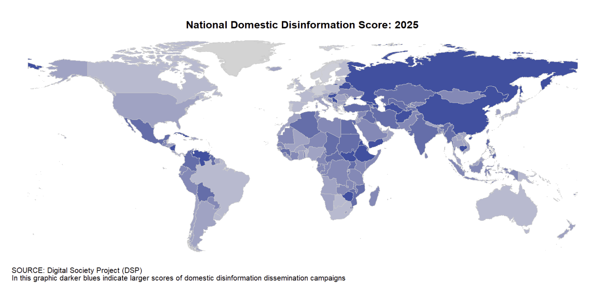
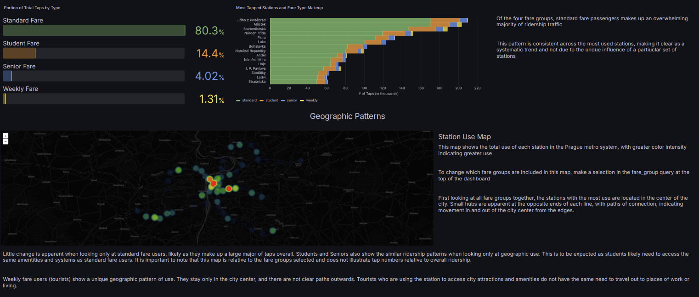
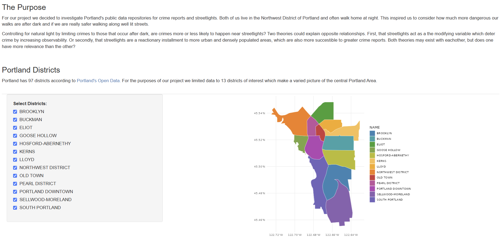
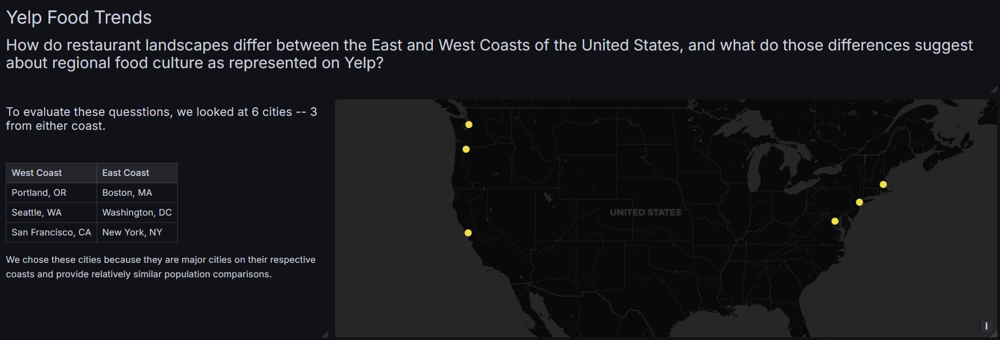

::::: columns
::: {.column width="40%"}

### Contact Information

Email: [margaretgiardello\@gmail.com](mailto:margaretgiardello@gmail.com)

Linkedin: [linkedin.com/in/margaret-giardello](https://linkedin.com/in/margaret-giardello)

Resume: <a href="files/Resume.pdf" target="_blank">Download my resume (PDF)</a>
:::

::: {.column width="10%"}

:::

::: {.column width="50%"}

## Hi, I'm Maggie!

I'm a data scientist finishing my Master's degree, with research
experience spanning experimental design, statistical analysis, data
engineering, and visualization in R, Python, and SQL. I like taking messy, multi-source data and turning it into findings
people can actually understand and use.

I'm passionate about data communication and using data to understand the world and people who live in it. Data is often inaccessible or unapproachable but it doesn't have to be! I believe data is useful in all circumstances and communication is its key to success. 

  

### Technical Skills

R · Python · SQL · Shiny Applications · Grafana Dashboarding · Data
Engineering · Data Visualization · GitHub Integration · Statistical
Analysis · Machine Learning · API Integration · Research Design ·
Qualtrics · Technical Writing · B1 Spanish
:::
:::::

  

# <u>Projects</u>

 

## Media Indicators of Misinformation
**Python, R, SQL, GitHub, Machine Learning | May 2026 – Aug 2026**

Can you predict where and when misinformation campaigns will happen just by
looking at how news gets covered? This capstone project analyzes millions of
news articles from around the world to find patterns that show up before or
during known misinformation campaigns, the goal being an early-warning signal
built from publicly available news coverage rather than any single flagged
source. What the articles are *about*  turned out to be a stronger
signal than their tone or emotional language. Additionally, disinformation campaigns originating within a country is noticeably easier to detect this way than from foreign sources, suggesting domestic campaigns tend to follow more
predictable patterns, while foreign ones are harder to pin down from surface-level features alone.

- Engineered a layered SQL view over the GDELT database in Google BigQuery,
  compressing 2.6TB of raw data down to roughly 3,000 rows for aggregated analysis
- Cleaned, filtered, joined, and transformed data across R, Python, and SQL
- Applied Random Forest modeling, PCA, and clustering for dimensionality reduction
- Found that thematic prevalence was more predictive than sentiment polarity or
  social media embeddings, and that domestic models outperformed foreign models — reinforcing that domestic campaigns follow more stable, detectable patterns
  while foreign campaigns remain harder to characterize using aggregate features
  alone
- Reporting results via technical paper and conference poster

[Read Our Report](https://wu-msds-capstones.github.io/project-writeup-maggie-elliana/)

 

## Prague Metro System
**SQL, Grafana, dbt | May 2026 – Aug 2026, 3-person team**

What can a city's public transit data tell you about how people actually move
through it? This team project built a full data pipeline, from raw, scattered
transit records to interactive dashboards. Data represented a simulated Prague metro system, aimed at helping transit planners see patterns in how riders use the network. The dashboards surfaced patterns across lines, zones, stations, fares, passenger volumes, and time of day, giving a practical foundation for thinking through where transit design changes could have the most impact.

- Engineered Python DAGs for ingestion, dbt/SQL for modeling, and Postgres for
  storage
- Integrated various sources including MongoDB, Neo4j, and Kafka
- Delivered biweekly Grafana dashboards tailored to specific business questions,
  surfacing usage patterns across lines, zones, stations, fares, passengers, and
  time of day

 

## Portland Lighting & Crime
**R, Shiny, Statistical Analysis, Data Visualization | Jan – May 2026**

Does better streetlighting actually make neighborhoods safer? This project
tests that question directly using real 2025 Portland crime and streetlight
data, focusing on the crime types most relevant to someone walking alone at
night. The analysis found support for the idea that lighting deters certain
kinds of nighttime crime, though it also pointed to open questions worth
digging into further, like whether other neighborhood factors are doing some
of that work alongside the lighting itself.

- Cleaned, spatially joined, and transformed disparate open-data sources in R
- Ran density analysis and chi-square testing, supporting the working theory
  while calling for more tailored future analysis that accounts for proxy
  variable relationships and temporal effects
- Built an interactive Shiny app letting users explore results by neighborhood
  and crime type

[Launch the Shiny app](https://maggie-g-willamette.shinyapps.io/502Final/)

 

## Yelp Cuisines
**Yelp API, PostgreSQL, Railway, Grafana | Jan – May 2026**

Do certain cities just have better, cheaper food? This project pulls real
restaurant data across six major US cities to compare cuisines, prices, and
customer ratings side by side, building out a full pipeline from raw API data
to a live dashboard along the way. Early results point to West Coast cities
offering a notably better combination of higher ratings and lower prices
compared to the other cities studied.

- Built a data pipeline from the Yelp Business API through Railway into
  Postgres, visualized in Grafana
- Found preliminary results of higher food ratings and lower costs along West
  Coast cities

